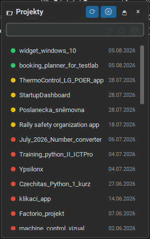

# Project Dashboard Widget

Malý bezrámečkový always-on-top widget na plochu Windows, který ukazuje seznam
všech tvých projektů (napříč libovolným počtem sledovaných složek), barevně
signalizuje, jak dávno se na nich pracovalo, a jedním kliknutím je otevře ve
VS Code.

> **Pozor na název:** repozitář/složka se jmenuje `widget_windows_10`, ale to
> je jen historický pozůstatek. Projekt je aktualizovaný pro **Windows 11**
> (spouštění bez VBScriptu, kulaté rohy okna); na Windows 10 dál funguje,
> jen s hranatými rohy.



## Funkce

- **Automatické hledání projektů** – prochází sledované složky a najde v nich
  vše, co vypadá jako projekt (obsahuje `.git`, `package.json`,
  `pyproject.toml`, `.sln`, ...).
- **Semafor podle stáří poslední změny** – 🟢 do 7 dní, 🟡 do 30 dní, 🔴 starší.
  Seznam je řazený od nejnovější změny.
- **Víc sledovaných složek** – přes tlačítko ⚙ v hlavičce lze přidávat/odebírat
  libovolný počet kořenových složek (nativní dialog na výběr složky).
- **Zámek pozice** – tlačítko 🔒/🔓 v hlavičce. Po zamčení se aktuální pozice
  natrvalo uloží a widget se příště otevře přesně tam; zároveň to zabrání
  omylem ho odtáhnout jinam.
- **Bez OS rámečku** – vlastní minimalistická hlavička místo standardního
  okna Windows (žádný titulek, žádné okno v taskbaru/Alt+Tabu).
- Vyhledávání v seznamu, tichý start bez konzole, volitelný automatický start
  s Windows.

## Jak to pozná "projekt"

Adresář je považován za projekt, pokud obsahuje jeden z marker souborů/složek
definovaných v configu (`.git`, `.vscode`, `package.json`, `pyproject.toml`,
`requirements.txt`, `*.sln`, `*.csproj`). Jakmile je projekt nalezen, do jeho
podsložek se dál neskenuje (takže se do seznamu nedostanou vnořené
podprojekty typu balíčků v `node_modules`).

## Instalace

Vyžaduje [uv](https://docs.astral.sh/uv/) a Python 3.13+.

```
git clone <URL tohoto repozitáře>
cd widget_windows_10
uv sync
```

Při prvním spuštění se automaticky založí osobní `config.json` podle šablony
`config.example.json` – uprav si v něm hlavně `root_paths` (jaké složky se
mají sledovat), zbytek jde doladit i přímo přes UI (⚙, 🔒).

## Spuštění

Ruční spuštění (s viditelnou konzolí, hodí se pro ladění):

```
uv run main.py
```

Tiché spuštění bez konzole (pro běžné používání):

```
.venv\Scripts\pythonw.exe main.py
```

(nebo dvojklik na zástupce vytvořeného přes `add_to_startup.ps1`, viz níže).
Starší `run_widget.vbs` zatím funguje taky, ale Windows 11 VBScript postupně
vypínají, takže na něj nespoléhej.

## Automatický start s Windows

```
powershell -File add_to_startup.ps1
```

Vytvoří zástupce v `shell:startup` (míří přímo na `pythonw.exe`, bez VBS), takže se widget spustí sám při každém
přihlášení. Zrušení: smaž `ProjectDashboardWidget.lnk` ze složky Po spuštění
(Win+R → `shell:startup`).

## Co si můžeš doladit sám

Většinu jde nastavit přímo ve widgetu (⚙ pro složky, 🔒 pro pozici). Zbytek je
v `config.json` (osobní, negitovaný soubor – šablona je `config.example.json`):

- `marker_files` – podle čeho se pozná "projekt" (podporuje i wildcard jako `*.sln`).
- `skip_dirs` – které podsložky se přeskakují (node_modules apod.).
- `max_scan_depth` – jak hluboko se má skenovat.
- `editor_command` – čím se projekt otevírá (výchozí `code`, jde nahradit
  třeba za `code-insiders` nebo cestu k jinému editoru).
- `window.corner` – roh obrazovky pro nezamčenou pozici (`top-right`, `top-left`, `bottom-right`, `bottom-left`).
- `window.width` / `window.height` / `window.margin_x` / `window.margin_y` – rozměry a odsazení okna.
- `window.opacity` – průhlednost okna (0.0–1.0).
- `window.always_on_top` – jestli má okno být pořád navrchu.

Po ruční úpravě `config.json` widget restartuj (změny přes ⚙/🔒 se naopak
projeví okamžitě, bez restartu).

## Licence

[MIT](LICENSE)
